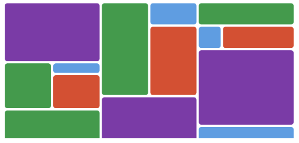

# masonry-gallery

# Website

https://lteranl.github.io/masonry-gallery/

Exercise:

In this exercise I'm building a complex masonry grid using CSS Grid Layout. Example grid below and turn it into a "masonry gallery".

Example

Finished

Things to Keep in Mind Before We Start:

-   Calculate the smallest grid cell that you want to have in your grid, i.e. the smallest image you want to have in your grid.
-   A cell is determined by the number of rows (height) and the number of columns (width) it spans.
-   The smallest cell size will determine how complex your grid will be.
-   Calculate the number of columns and rows based on the smallest cell.
-   You can use either the grid-row / grid-column method or grid-template-areas - the choice is yours.

Post an image of your final result to the #post-your-projects channel in the chatroom
